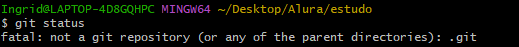
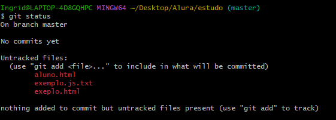

# Git: Ramas y Conflictos

En esta lección aprenderás a trabajar con ramas en git y a resolver conflictos que puedan surgir al fusionar ramas. También veremos algunos errores comunes que puedes encontrar al trabajar con git y cómo solucionarlos.


## Ramas en git

Las ramas en git son una característica importante que permite a los desarrolladores trabajar en diferentes versiones de un proyecto de forma simultánea. Cada rama en git es una línea de desarrollo independiente que permite a los desarrolladores trabajar en nuevas características, correcciones de errores o experimentos sin afectar la rama principal del proyecto.

Las ramas en git son útiles para:
- Desarrollar nuevas características sin afectar la rama principal del proyecto.
- Experimentar con nuevas ideas sin comprometer el código existente.
- Trabajar en correcciones de errores o mejoras sin interrumpir el flujo de trabajo principal.
- Colaborar con otros desarrolladores en diferentes aspectos del proyecto.

Se recomienda crear ramas por cada nueva característica o tarea que estés trabajando en tu proyecto. 


Para trabajar con ramas los comandos son:

```bash 
git branch nombre_rama // para crear una rama
git checkout nombre_rama // para cambiar de rama
```

Para unir ramas:

```bash
git merge nombre_rama // para unir la rama actual con la rama nombre_rama
```


## Resolver los conflictos

Los conflictos en git ocurren cuando dos ramas tienen cambios en la misma línea de código. Tambien suceden cuando hay varias personas trabajando en el mismo proyecto y realizan cambios en el mismo archivo.

Para resolver los conflictos en git, debes seguir los siguientes pasos:

1. Abre el archivo con conflicto en un editor de código.
2. Busca las marcas de conflicto `<<<<<<<`, `=======`, y `>>>>>>>`.
3. Edita el archivo para resolver el conflicto.
4. Guarda los cambios y realiza un commit para finalizar la resolución del conflicto.


## GIT: Errores de comandos y directorios
  
### Not a git command (no es un comando de git)


**Problema**: En el ejemplo arriba el error ocurre porque el comando git merna no existe en git, pero si git merge, como git sugiere. Este error ocasiona un tipo de problema de escritura.

**Solución:** Revisar la escritura del comando que está intentando revisar. Si no tiene seguridad de la escritura, utilice el comando git --help para que vea la lista de comandos válidos. 

### No such file or directory(El fichero o directorio no existe)


**Problema:** El error "No such file or directory" en Git indica que el archivo o directorio que está intentando acceder no existe en el sistema de archivos.

**Solución:** Para resolver este problema, asegúrese de que el archivo o directorio que está intentando acceder exista en el sistema de archivos. Puedes verificar la existencia del archivo o directorio utilizando el comando `ls` en la línea de comandos. Si el directorio no está en la ubicación actual, asegúrate de estar en el directorio correcto o proporciona la ruta completa al directorio para cambiar a él utilizando el comando cd.

### not a git repository (no es un repositorio git)



**Problema:** El error "not a git repository" en Git indica que el directorio actual no es un repositorio Git válido.

**Solución:** Para resolver este problema, asegúrate de estar en el directorio correcto que contiene un repositorio Git. Puede verificar si un directorio es un repositorio Git utilizando el comando `git status`. Si el directorio actual no es un repositorio Git, puede inicializar un nuevo repositorio Git en el directorio utilizando el comando `git init`.

### No commits yet (No hay commits todavía)



**Problema:** El mensaje No commits yet se muestra en Git cuando inicializas un nuevo repositorio o cuando no has realizado ningún commit aún. Es un mensaje predeterminado que indica que no hay historial de commits en el repositorio.

**Solución:** Para resolver este problema, debes realizar al menos un commit en el repositorio. Puedes hacerlo agregando archivos al área de preparación (staging area) utilizando el comando ` git add` y luego confirmar los cambios utilizando el comando `git commit`.


## GIT: errores de commits

### Aborting commit due to empty commit message (Abortar la confirmación debido a un mensaje de confirmación vacío)

**Problema:** Este error ocurre cuando intenta realizar un commit sin un mensaje de confirmación. Git no permite confirmaciones sin mensajes de confirmación.

**Solución:** Para resolver este problema, debe agregar un mensaje de confirmación al comando git commit. Puede hacerlo utilizando el siguiente comando:

```bash
git commit -m "mensaje de confirmación"
```

### nothing added to commit but untracked files present (nada agregado para confirmar pero archivos sin seguimiento presentes)

**Problema**: El mensaje de error nothing added to commit but untracked files present en Git indica que hay archivos sin rastrear en el directorio de trabajo que no han sido agregados al área de preparación (staging area) antes de hacer el commit.

**Solución**: Para resolver este problema, primero debes agregar los archivos sin rastrear al área de preparación utilizando el comando `git add`. Y luego haz `git commit` para confirmar los cambios.

## GIT: Errores de merge

### Please commit your changes or stash them before you can merge (Confirme sus cambios o guárdelos antes de poder fusionarlos)

**Problema**: Este error ocurre cuando intenta fusionar dos ramas en Git y hay cambios sin confirmar en la rama actual.

**Solución**: Para resolver este problema, primero debe confirmar los cambios en la rama actual antes de fusionar las ramas. Puede hacerlo utilizando los siguientes comandos:

```bash
git add .
git commit -m "mensaje de confirmación"
git merge nombre_rama
```

## GIT: Errores con el remoto

### Repository not found (Repositorio no encontrado)

**Problema:** El error "Repository not found" en Git indica que el repositorio remoto al que estás intentando acceder no existe en el servidor remoto.

**Solución:** Para resolver este problema, verifica que la URL del repositorio remoto sea correcta y que el repositorio exista en el servidor remoto. Puedes verificar la URL del repositorio remoto utilizando el comando `git remote -v` y asegurarte de que esté configurada correctamente.

### Permission denied (Permiso denegado)
```bash
git@github.com: Permission denied (publickey) 
```

**Problema:** El error "Permission denied" en Git indica que no tienes permiso para acceder al repositorio remoto o realizar operaciones en él.

**Solución:** Para resolver este problema, debes asegurarte de tener los permisos adecuados para acceder al repositorio remoto. Puedes verificar tus permisos en la configuración del repositorio remoto en Github) y asegurarte de que estén configurados correctamente. Si estás utilizando la autenticación por clave SSH, asegúrate de que tu clave pública esté configurada en tu cuenta de usuario en la plataforma de alojamiento.


### Automatic merge failed; fix conflicts and then commit the result(Fusión automática fallida; solucione los conflictos y luego confirme el resultado)

**Problema:** El error "Automatic merge failed; fix conflicts and then commit the result" en Git indica que ha ocurrido un conflicto durante la fusión de dos ramas y Git no pudo resolverlo automáticamente.

**Solución:** Para resolver este problema, debes abrir el archivo con conflicto en un editor de código, buscar las marcas de conflicto `<<<<<<<`, `=======`, y `>>>>>>>`, y editar el archivo para resolver el conflicto. Luego, guarda los cambios y realiza un commit para finalizar la resolución del conflicto.

### Pathspec did not match any file(s) known to git (pathspec no coincidió con ningún archivo conocido por git)

```bash
error: pathspec '<branch_name>' did not match any file(s) known to git
```

**Problema:** El error "Pathspec did not match any file(s) known to git" en Git indica que el nombre de la rama especificado no coincide con ninguna rama conocida en el repositorio.

**Solución:** Para resolver este problema, asegúrate de que el nombre de la rama especificado sea correcto y coincida con una rama existente en el repositorio. Puedes verificar las ramas existentes en el repositorio utilizando el comando `git branch` y asegurarte de que el nombre de la rama sea correcto.

## Buenas practicas en git: evitando errores
1. Lea la documentación de [Git](https://git-scm.com/doc)
2. EXplora git desde la línea de comandos `git --help`
   
3. Antes de realizar cualquier operación en Git, verifica el estado actual del repositorio utilizando el comando `git status`.

   Cuando ejecutas git status, obtendrás información sobre varios aspectos del repositorio:
      - Rama actual: git status te mostrará en qué rama te encuentras actualmente.
      - Cambios sin confirmar: Git te mostrará una lista de los archivos modificados que aún no se han confirmado mediante un commit.
      - Archivos preparados para el commit :Si has utilizado el comando git add para preparar archivos para el siguiente commit, git status te mostrará una lista de los archivos que están en el área de preparación (staging area).
      - Archivos no rastreados: Si hay archivos en tu directorio de trabajo que no están siendo rastreados por Git, git status te mostrará una lista de estos archivos.

4. Antes de comenzar a trabajar en tu repositorio local, se recomienda ejecutar el comando git pull para obtener las últimas actualizaciones del repositorio remoto.

5. Hacer commits frecuentes y significativos: Realiza commits con frecuencia y asegúrate de que cada commit represente una unidad lógica de cambios significativos. 

6. Utilizar ramas separadas y evitar cambios directos en la rama principal (master/main)
   
7. Utilizar archivos `.gitignore`: El archivo `.gitignore` te permite especificar patrones de nombres de archivos o directorios que Git debe ignorar al realizar operaciones como add o commit.